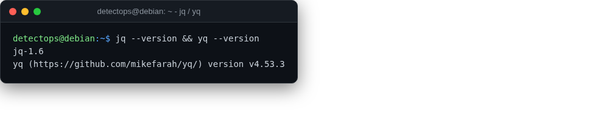

# jq / yq

<span class="cat-badge" style="background:#C2A544">system</span>

Command-line JSON and YAML processors, for scripting Detection-as-Code pipelines.



## How to run

```bash
cat rule.yml | yq '.detection'
```

---

*Part of the **Dev / Scripting Toolchain** toolset in DetectOps.*
