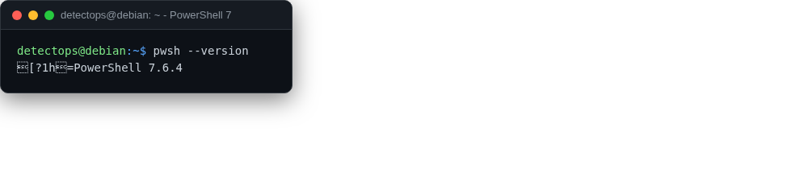

# PowerShell 7

<span class="cat-badge" style="background:#C2A544">system</span>

Cross-platform pwsh, pre-loaded with the Atomic Red Team profile.



## How to run

```bash
pwsh
```

## Reference

[https://github.com/PowerShell/PowerShell](https://github.com/PowerShell/PowerShell)

---

*Part of the **Dev / Scripting Toolchain** toolset in DetectOps.*
