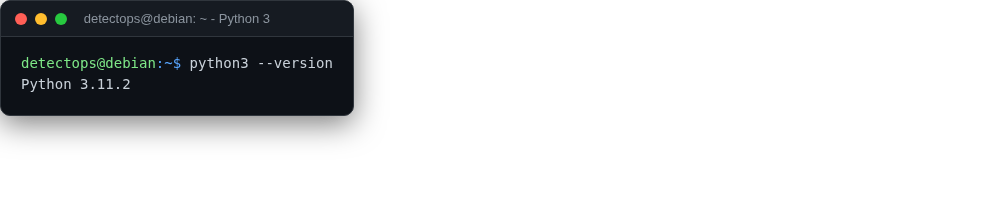

# Python 3

<span class="cat-badge" style="background:#C2A544">system</span>

pip, venv, and dev headers all included.



## How to run

```bash
python3 -m venv env
```

## Reference

[https://www.python.org/](https://www.python.org/)

---

*Part of the **Dev / Scripting Toolchain** toolset in DetectOps.*
