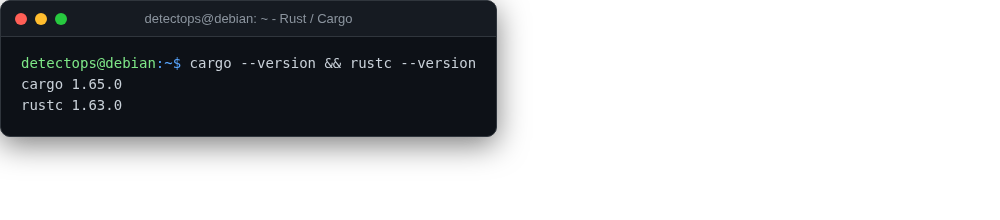

# Rust / Cargo

<span class="cat-badge" style="background:#C2A544">system</span>

For the Rust-based tools (Chainsaw, Hayabusa, YARA-X all began here).



## How to run

```bash
cargo build --release
```

## Reference

[https://www.rust-lang.org/](https://www.rust-lang.org/)

---

*Part of the **Dev / Scripting Toolchain** toolset in DetectOps.*
