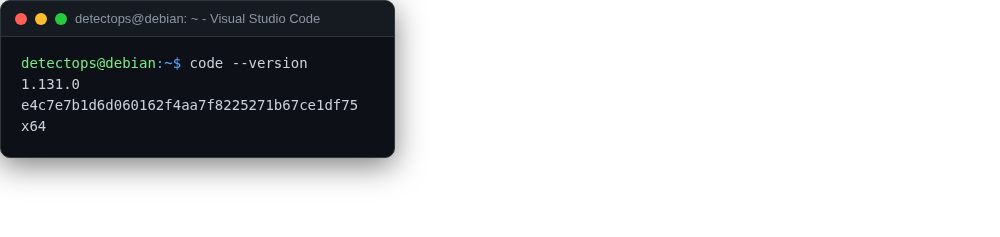

# Visual Studio Code

<span class="cat-badge" style="background:#C2A544">system</span>

For editing Sigma rules, hooks, and everything else in this manifest.



## How to run

```bash
code .
```

---

*Part of the **Dev / Scripting Toolchain** toolset in DetectOps.*
