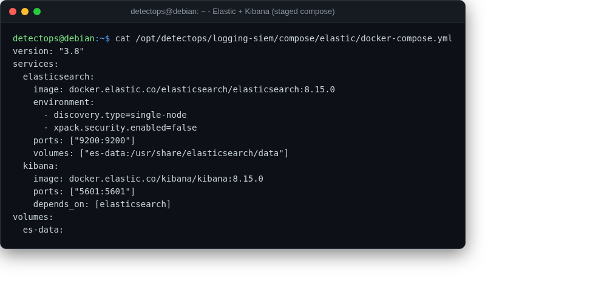

# Elastic + Kibana

compose

Not pre-pulled (multi-GB images) — a ready compose file is staged instead.

## Location

`/opt/detectops/logging-siem/compose/elastic/docker-compose.yml`

!!! warning "Manual step required"
    first `docker-compose up -d` needs internet to pull images

## Reference

[https://github.com/elastic/kibana](https://github.com/elastic/kibana)

---

*Part of the **Logging & SIEM** toolset in DetectOps.*
