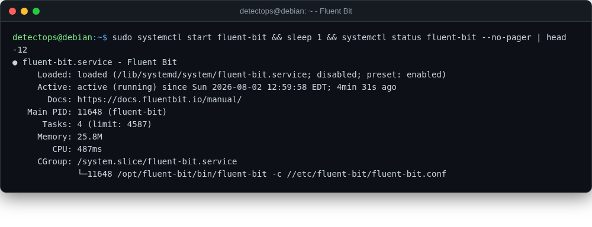

# Fluent Bit

<span class="cat-badge" style="background:#5B9BD5">service</span>

Lightweight log/metrics forwarder — the workhorse shipping side.



## How to run

```bash
sudo systemctl start fluent-bit   # configure /etc/fluent-bit/fluent-bit.conf first
```

## Reference

[https://github.com/fluent/fluent-bit](https://github.com/fluent/fluent-bit)

---

*Part of the **Logging & SIEM** toolset in DetectOps.*
