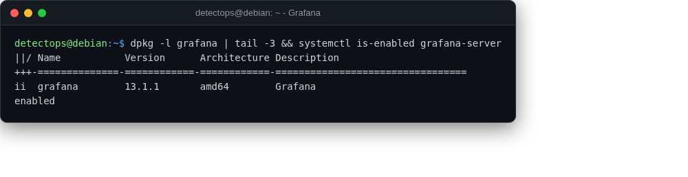

# Grafana

<span class="cat-badge" style="background:#5B9BD5">service</span>

Dashboards for anything with a datasource — Loki included.



## How to run

```bash
sudo systemctl start grafana-server
```

!!! note
    browse `http://<vm-ip>:3000` — first login `admin/admin`, forces a reset


## Reference

[https://github.com/grafana/grafana](https://github.com/grafana/grafana)

---

*Part of the **Logging & SIEM** toolset in DetectOps.*
