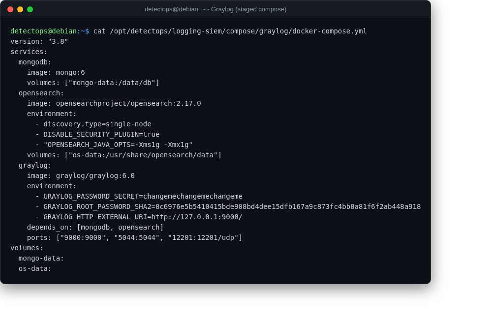

# Graylog

compose

Log management on Mongo + OpenSearch — staged compose, pulled on demand.

## Location

`/opt/detectops/logging-siem/compose/graylog/docker-compose.yml`

## Reference

[https://github.com/Graylog2/graylog2-server](https://github.com/Graylog2/graylog2-server)

---

*Part of the **Logging & SIEM** toolset in DetectOps.*
