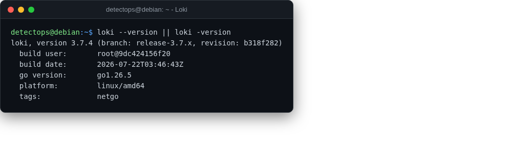

# Loki

<span class="cat-badge" style="background:#5B9BD5">binary</span>

Grafana's log-aggregation backend, indexed by label not full text.



## Location

`/usr/local/bin/loki`

## How to run

```bash
loki --config.file=loki-config.yaml
```

---

*Part of the **Logging & SIEM** toolset in DetectOps.*
