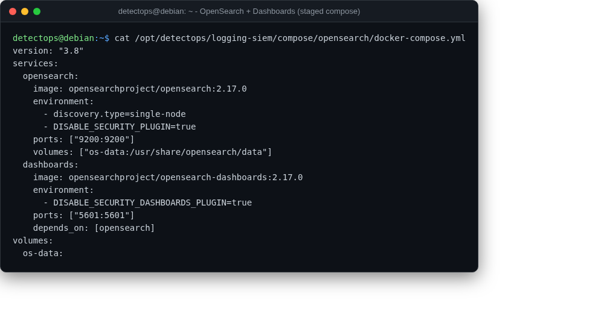

# OpenSearch + Dashboards

compose

Same policy as Elastic — staged compose, pulled on demand.

## Location

`/opt/detectops/logging-siem/compose/opensearch/docker-compose.yml`

!!! warning "Manual step required"
    first run needs internet

## Reference

[https://github.com/opensearch-project/OpenSearch](https://github.com/opensearch-project/OpenSearch)

---

*Part of the **Logging & SIEM** toolset in DetectOps.*
