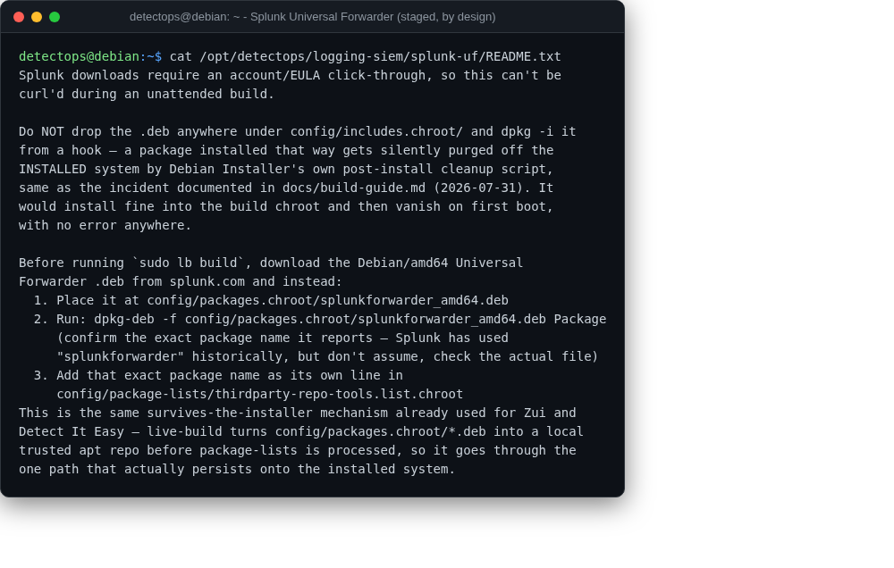

# Splunk Universal Forwarder

manual

Requires a splunk.com login, so it can't be fetched during the build.

## Location

`/opt/detectops/logging-siem/splunk-uf/README.txt`

!!! warning "Manual step required"
    see that README for the build-time steps — must go through `config/packages.chroot/`, not a hook drop-in, or the installer purges it on first boot

---

*Part of the **Logging & SIEM** toolset in DetectOps.*
