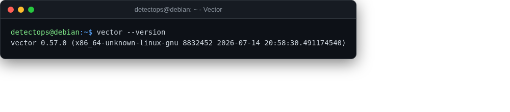

# Vector

<span class="cat-badge" style="background:#5B9BD5">system</span>

Observability data pipeline — route logs/metrics between anything.



## How to run

```bash
vector --config vector.toml
```

---

*Part of the **Logging & SIEM** toolset in DetectOps.*
