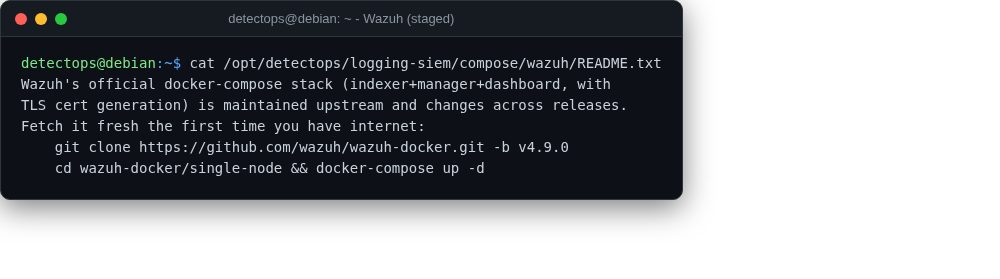

# Wazuh

compose

Open-source XDR/SIEM. Upstream's own compose changes per release, so it's fetched fresh rather than pinned stale.

## Location

`/opt/detectops/logging-siem/compose/wazuh/README.txt`

!!! warning "Manual step required"
    clone `wazuh/wazuh-docker` yourself the first time you're online

## Reference

[https://github.com/wazuh/wazuh-docker](https://github.com/wazuh/wazuh-docker)

---

*Part of the **Logging & SIEM** toolset in DetectOps.*
