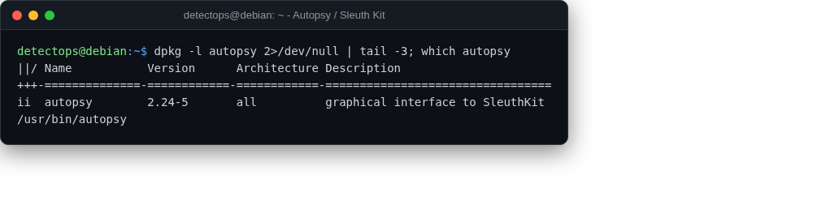

# Autopsy / Sleuth Kit

<span class="cat-badge" style="background:#B478A6">system</span>

Disk-image forensics — GUI (Autopsy) over the Sleuth Kit's CLI tools.



## How to run

```bash
autopsy
```

## Reference

[https://github.com/sleuthkit/autopsy](https://github.com/sleuthkit/autopsy)

---

*Part of the **Malware & Forensics** toolset in DetectOps.*
