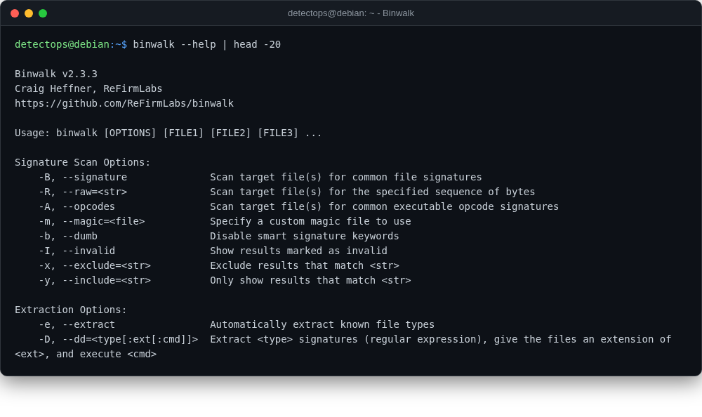

# Binwalk

<span class="cat-badge" style="background:#B478A6">system</span>

Finds and extracts embedded files/firmware inside a binary blob.



## How to run

```bash
binwalk -e firmware.bin
```

## Reference

[https://github.com/ReFirmLabs/binwalk](https://github.com/ReFirmLabs/binwalk)

---

*Part of the **Malware & Forensics** toolset in DetectOps.*
