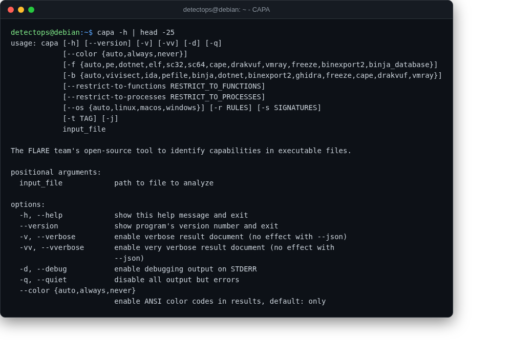

# CAPA

<span class="cat-badge" style="background:#B478A6">binary</span>

Identifies capabilities (persistence, C2, etc.) in a binary automatically.



## Location

`/usr/local/bin/capa`

## How to run

```bash
capa sample.exe
```

## Reference

[https://github.com/mandiant/capa](https://github.com/mandiant/capa)

---

*Part of the **Malware & Forensics** toolset in DetectOps.*
