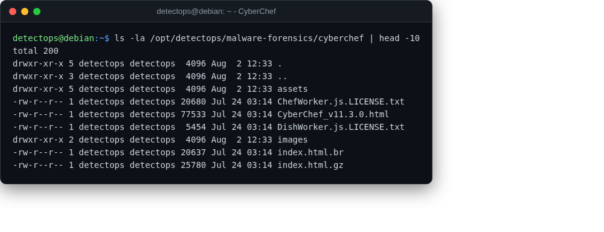

# CyberChef

<span class="cat-badge" style="background:#B478A6">offline</span>

The "cyber Swiss Army knife" for decoding/transforming data — runs fully offline.



## Location

`/opt/detectops/malware-forensics/cyberchef`

## How to run

```bash
cyberchef   # or launch "CyberChef" from the applications menu
```

---

*Part of the **Malware & Forensics** toolset in DetectOps.*
