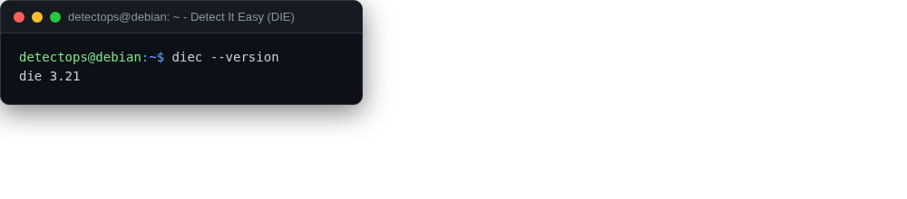

# Detect It Easy (DIE)

<span class="cat-badge" style="background:#B478A6">app</span>

Identifies file types, packers, and compilers at a glance.



## How to run

```bash
die   # GUI, or: diec sample.exe
```

## Reference

[https://github.com/horsicq/Detect-It-Easy](https://github.com/horsicq/Detect-It-Easy)

---

*Part of the **Malware & Forensics** toolset in DetectOps.*
