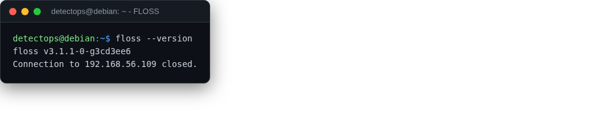

# FLOSS

<span class="cat-badge" style="background:#B478A6">binary</span>

Extracts obfuscated/stacked/encoded strings malware tries to hide.



## Location

`/usr/local/bin/floss`

## How to run

```bash
floss sample.exe
```

---

*Part of the **Malware & Forensics** toolset in DetectOps.*
