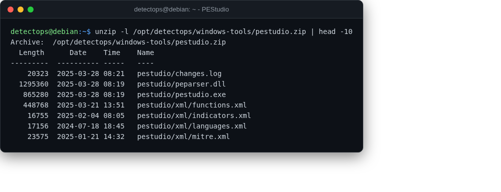

# PEStudio

staged

Static triage for Windows PE files — Windows-only, staged for that VM.

## Location

`/opt/detectops/windows-tools/pestudio.zip`

!!! info "Windows-only"
    copy to your Windows analysis VM and extract

---

*Part of the **Malware & Forensics** toolset in DetectOps.*
