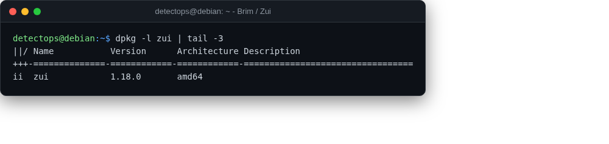

# Brim / Zui

<span class="cat-badge" style="background:#7CAE72">app</span>

Desktop app for searching Zeek logs and pcaps side by side.



## How to run

```bash
zui   # or launch "Zui" from the applications menu
```

---

*Part of the **Network Security** toolset in DetectOps.*
