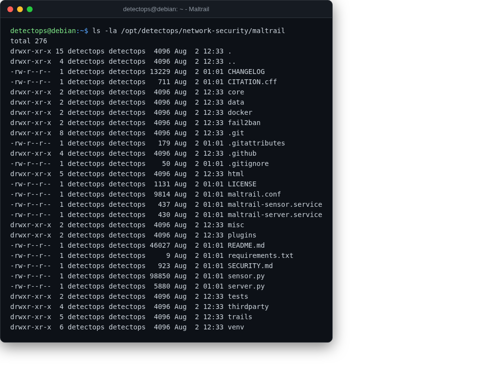

# Maltrail

<span class="cat-badge" style="background:#7CAE72">venv</span>

Detects known-malicious traffic against public blacklists/heuristics.



## Location

`/opt/detectops/network-security/maltrail`

## How to run

```bash
menu → 4, or:
sudo venv/bin/python3 sensor.py
```

---

*Part of the **Network Security** toolset in DetectOps.*
