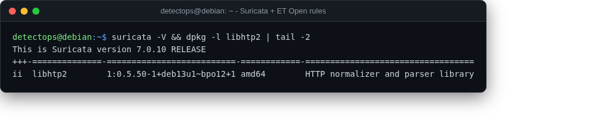

# Suricata + ET Open rules

<span class="cat-badge" style="background:#7CAE72">backports</span>

IDS/IPS engine (installed from bookworm-backports — not in Debian's main archive) with the Emerging Threats Open ruleset pre-downloaded.



## Location

`/opt/detectops/network-security/suricata-rules`

## How to run

```bash
sudo suricata -i eth0 -S suricata-rules/emerging-all.rules
```

## Reference

[https://github.com/OISF/suricata](https://github.com/OISF/suricata)

---

*Part of the **Network Security** toolset in DetectOps.*
