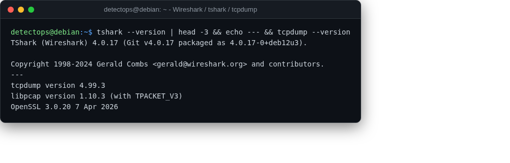

# Wireshark / tshark / tcpdump

<span class="cat-badge" style="background:#7CAE72">system</span>

Packet capture and inspection, GUI and CLI.



## How to run

```bash
wireshark   # GUI, or: sudo tcpdump -i eth0 -w cap.pcap
```

---

*Part of the **Network Security** toolset in DetectOps.*
