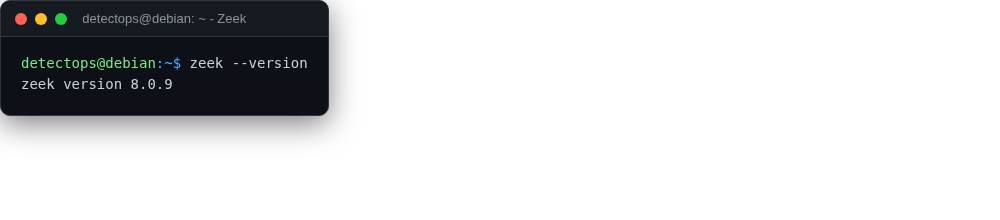

# Zeek

<span class="cat-badge" style="background:#7CAE72">system</span>

Protocol-aware network monitor that turns traffic into structured logs.



## How to run

```bash
sudo zeek -i eth0   # or: zeekctl deploy
```

---

*Part of the **Network Security** toolset in DetectOps.*
