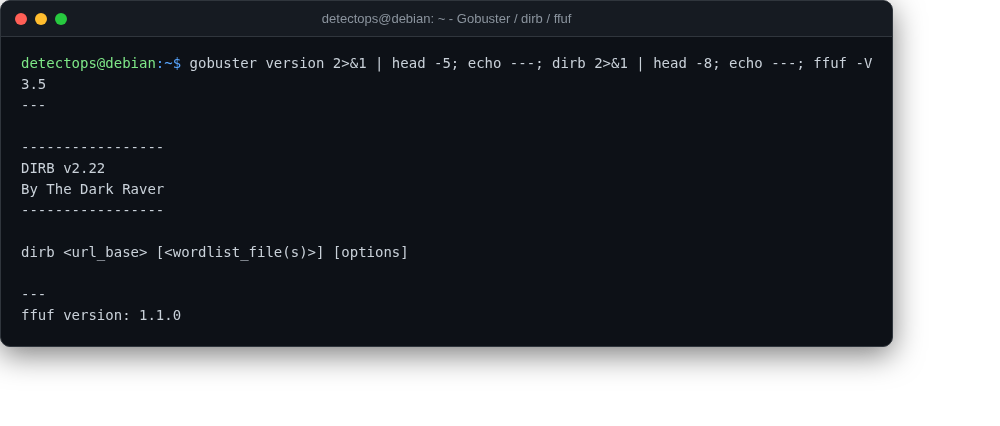

# Gobuster / dirb / ffuf

<span class="cat-badge" style="background:#C6768E">system</span>

Directory/vhost/parameter fuzzing for web app recon.



## How to run

```bash
gobuster dir -u https://target -w wordlist.txt
```

---

*Part of the **Security Utilities** toolset in DetectOps.*
