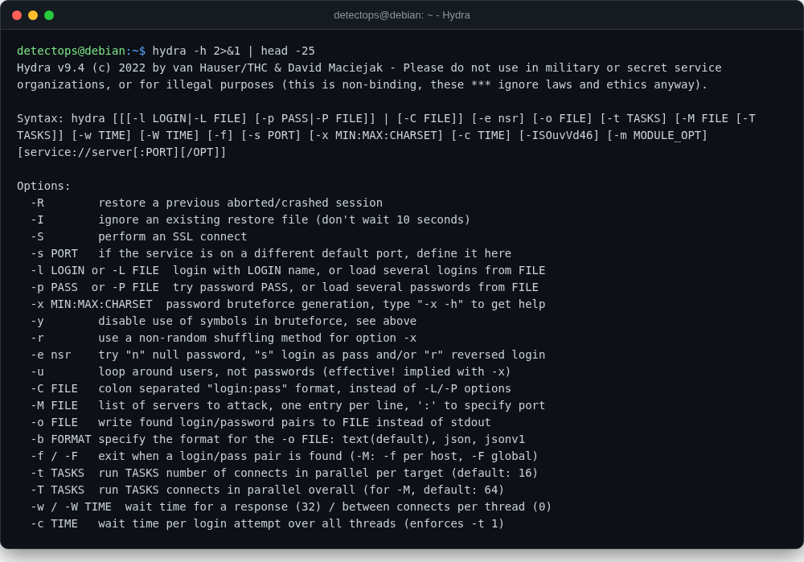

# Hydra

<span class="cat-badge" style="background:#C6768E">system</span>

Online credential brute-forcing across dozens of protocols.



## How to run

```bash
hydra -l admin -P wordlist.txt ssh://10.0.0.5
```

## Reference

[https://github.com/vanhauser-thc/thc-hydra](https://github.com/vanhauser-thc/thc-hydra)

---

*Part of the **Security Utilities** toolset in DetectOps.*
