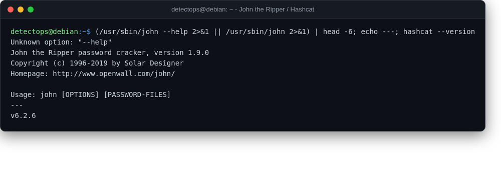

# John the Ripper / Hashcat

<span class="cat-badge" style="background:#C6768E">system</span>

Offline password/hash cracking, CPU (John) and GPU (Hashcat).



## How to run

```bash
hashcat -m 1000 hashes.txt wordlist.txt
```

## Reference

[https://github.com/openwall/john](https://github.com/openwall/john)

---

*Part of the **Security Utilities** toolset in DetectOps.*
