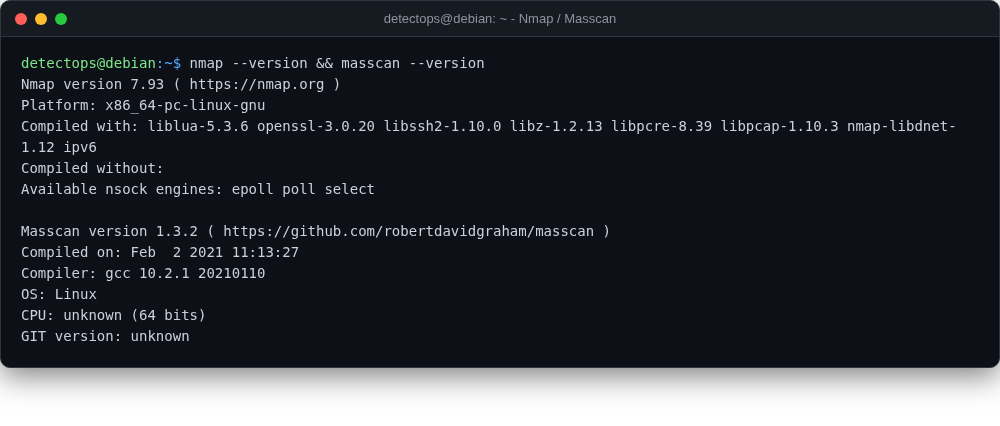

# Nmap / Masscan

<span class="cat-badge" style="background:#C6768E">system</span>

Port scanning — thorough (Nmap) or internet-scale fast (Masscan).



## How to run

```bash
nmap -sV -p- 10.0.0.0/24
```

---

*Part of the **Security Utilities** toolset in DetectOps.*
