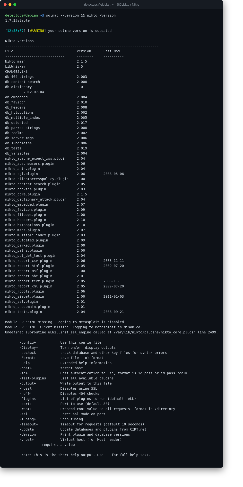

# SQLMap / Nikto

<span class="cat-badge" style="background:#C6768E">system</span>

Automated SQL-injection testing and web-server vuln scanning.



## How to run

```bash
sqlmap -u "https://target/?id=1"
```

## Reference

[https://github.com/sqlmapproject/sqlmap](https://github.com/sqlmapproject/sqlmap)

---

*Part of the **Security Utilities** toolset in DetectOps.*
