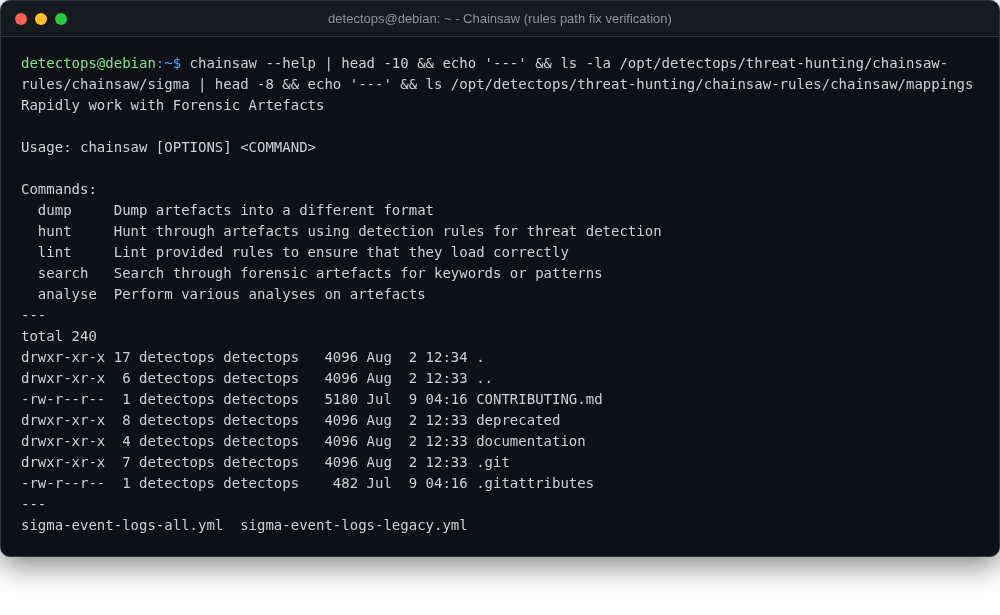

# Chainsaw

<span class="cat-badge" style="background:#9689D6">binary</span>

Rapid triage of Windows forensic artefacts, shipped with its Sigma-mapped ruleset.



## Location

`/usr/local/bin/chainsaw` · rules in `/opt/detectops/threat-hunting/chainsaw-rules/chainsaw`

## How to run

```bash
chainsaw hunt ./evtx_dir -s chainsaw-rules/chainsaw/sigma --mapping chainsaw-rules/chainsaw/mappings/sigma-event-logs-all.yml
```

## Reference

[https://github.com/WithSecureLabs/chainsaw](https://github.com/WithSecureLabs/chainsaw)

---

*Part of the **Threat Hunting & Endpoint Analysis** toolset in DetectOps.*
