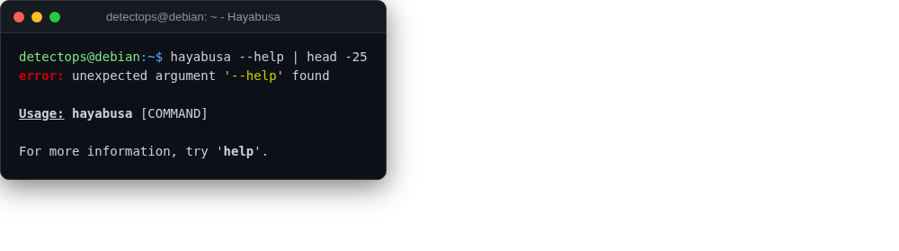

# Hayabusa

<span class="cat-badge" style="background:#9689D6">binary</span>

Fast Windows event-log hunting with built-in Sigma-based detection rules.



## Location

`/usr/local/bin/hayabusa`

## How to run

```bash
hayabusa csv-timeline -d ./evtx_dir -o results.csv
```

## Reference

[https://github.com/Yamato-Security/hayabusa](https://github.com/Yamato-Security/hayabusa)

---

*Part of the **Threat Hunting & Endpoint Analysis** toolset in DetectOps.*
