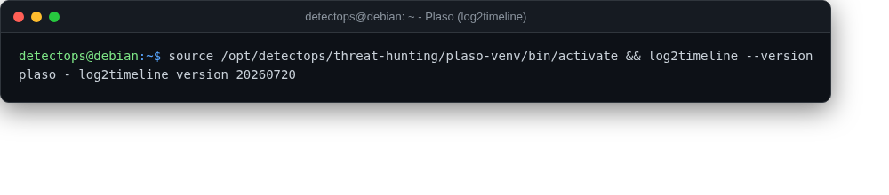

# Plaso (log2timeline)

<span class="cat-badge" style="background:#9689D6">venv</span>

Builds a unified super-timeline from disparate forensic artefacts.



## Location

`/opt/detectops/threat-hunting/plaso-venv`

## How to run

```bash
source /opt/detectops/threat-hunting/plaso-venv/bin/activate
log2timeline timeline.plaso ./image.dd
```

---

*Part of the **Threat Hunting & Endpoint Analysis** toolset in DetectOps.*
