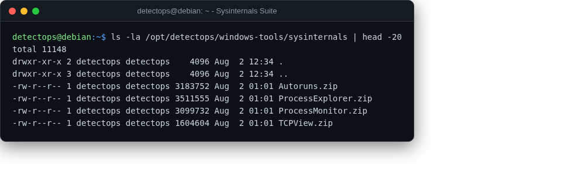

# Sysinternals suite

staged

Autoruns, Process Monitor, Process Explorer, TCPView — staged, not run here.

## Location

`/opt/detectops/windows-tools/sysinternals/*.zip`

!!! info "Windows-only"
    copy the zip to the Windows box you're analyzing and extract

---

*Part of the **Threat Hunting & Endpoint Analysis** toolset in DetectOps.*
