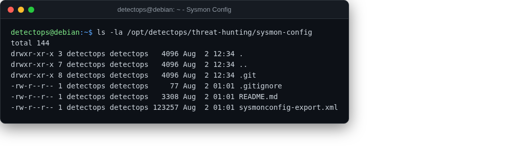

# Sysmon config

reference

SwiftOnSecurity's battle-tested Sysmon logging configuration, ready to deploy.

## Location

`/opt/detectops/threat-hunting/sysmon-config`

!!! info "Windows-only"
    copy `sysmonconfig-export.xml` and run `sysmon64 -i sysmonconfig-export.xml`

## Reference

[https://github.com/SwiftOnSecurity/sysmon-config](https://github.com/SwiftOnSecurity/sysmon-config)

---

*Part of the **Threat Hunting & Endpoint Analysis** toolset in DetectOps.*
