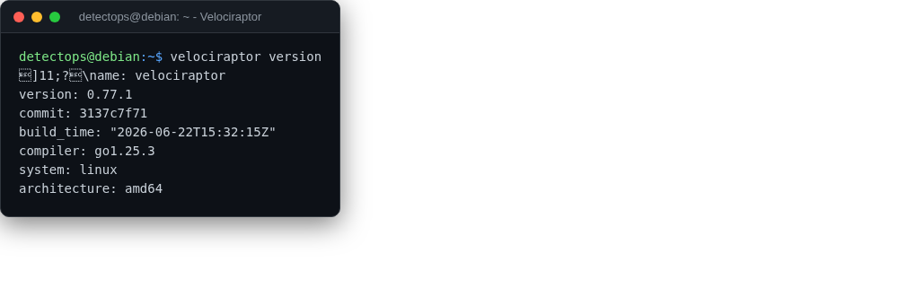

# Velociraptor

<span class="cat-badge" style="background:#9689D6">binary</span>

Endpoint visibility and DFIR at scale — one static binary, client or server.



## Location

`/usr/local/bin/velociraptor`

## How to run

```bash
velociraptor gui
```

---

*Part of the **Threat Hunting & Endpoint Analysis** toolset in DetectOps.*
