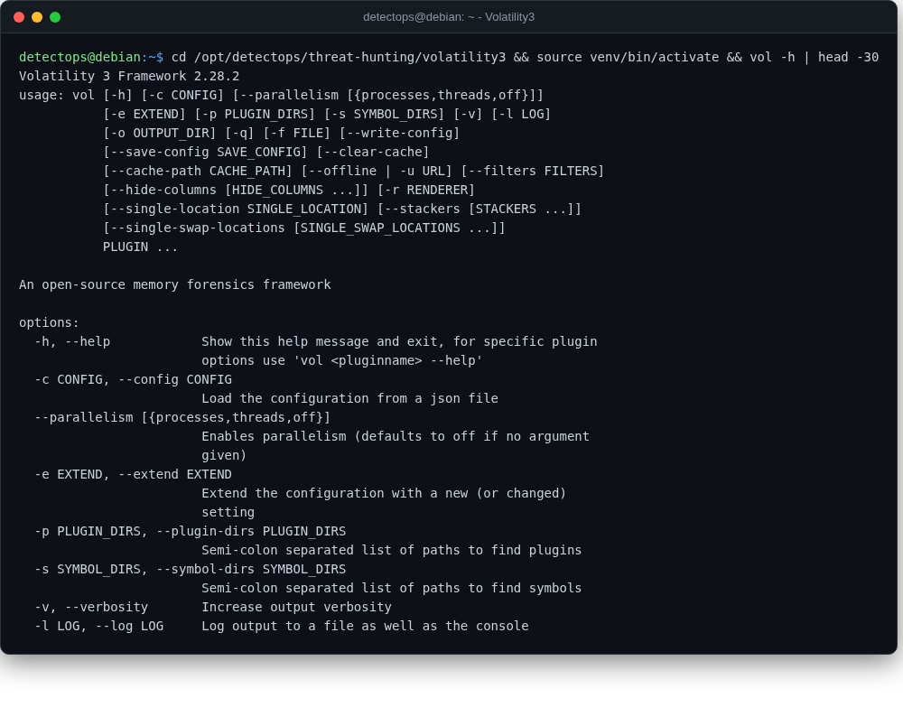

# Volatility3

<span class="cat-badge" style="background:#9689D6">venv</span>

Memory-forensics framework for analyzing RAM captures.



## Location

`/opt/detectops/threat-hunting/volatility3`

## How to run

```bash
source venv/bin/activate && vol -f memory.dmp windows.pslist
```

## Reference

[https://github.com/volatilityfoundation/volatility3](https://github.com/volatilityfoundation/volatility3)

---

*Part of the **Threat Hunting & Endpoint Analysis** toolset in DetectOps.*
