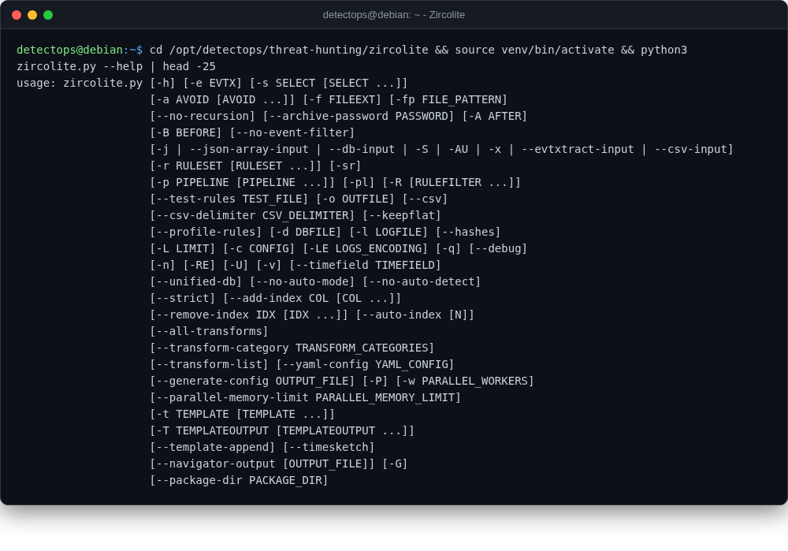

# Zircolite

<span class="cat-badge" style="background:#9689D6">venv</span>

Runs Sigma rules directly against EVTX/JSON logs, no SIEM required.



## Location

`/opt/detectops/threat-hunting/zircolite`

## How to run

```bash
menu → 3, or:
source venv/bin/activate && python3 zircolite.py --evtx ./logs
```

## Reference

[https://github.com/wagga40/Zircolite](https://github.com/wagga40/Zircolite)

---

*Part of the **Threat Hunting & Endpoint Analysis** toolset in DetectOps.*
